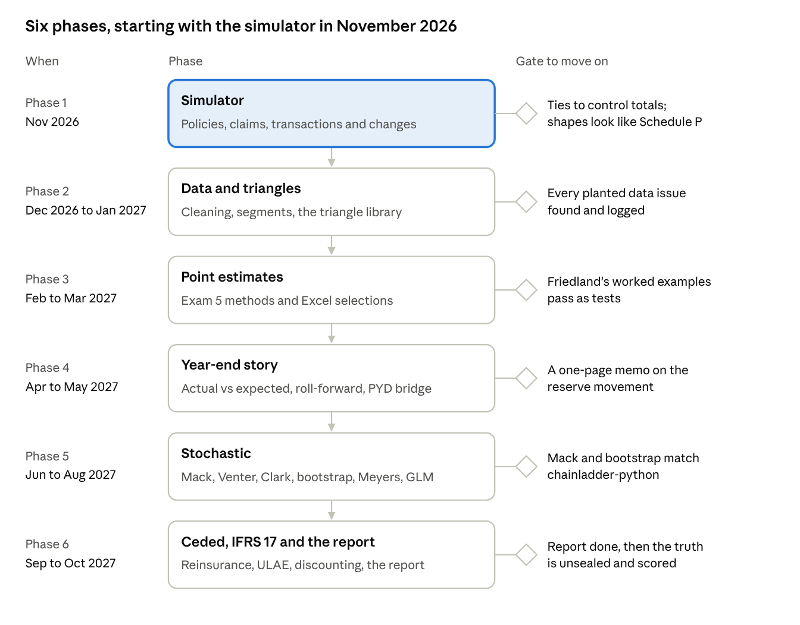

# Granite Reserving: Project Scope

Last updated October 2, 2026.

## Goal and the carrier

The project is a full year-end reserve review of a made-up mid-sized Canadian P&C insurer. It runs from raw claim transactions at December 31, 2025 to a signed-off reserve report, across 15 accident years (2011 to 2025) and seven lines. It also includes the prior review at December 31, 2024, so there is something to roll forward from and to explain strengthening and releases against.

The carrier is fictional: **Granite Lantern Insurance**, about $750M CAD of gross written premium, growing about 4% a year.

| Line | Tail | Basis | GWP 2025 ($M) | Claims per year | Why it's in |
| --- | --- | --- | --- | --- | --- |
| Personal auto: physical damage | Short | Occurrence | 110 | 45,000 | Fast, high-volume baseline; COVID frequency drop |
| Personal auto: bodily injury and accident benefits (Ontario) | Long | Occurrence | 190 | 9,000 | Benefit reform, slow settlement, large losses |
| Homeowners | Short | Occurrence | 160 | 22,000 | Catastrophes, seasonality, salvage and subrogation |
| Commercial property | Short to medium | Occurrence | 90 | 4,000 | Quota share and per-risk excess of loss |
| Commercial auto | Medium | Occurrence | 60 | 3,500 | Thin data, so credibility matters |
| Commercial general liability | Long | Occurrence | 100 | 2,500 | Case-reserve strengthening, a deductible program |
| Professional liability (E&O, D&O) | Long | Claims-made | 40 | 600 | Report-year triangles, very thin and volatile |

That comes to about 87,000 claims a year: roughly 1.3 million claims and 10 to 15 million transactions over 15 years.

**Done** means seven things:

1. A clean claim and transaction warehouse.
2. A triangle library.
3. A Python method engine.
4. An Excel selection workbook per line.
5. Stochastic ranges.
6. Gross, ceded and net reserves under IFRS 17.
7. An Appointed-Actuary-style report, plus a write-up on The Big One page of [Leo's Log](https://www.megacrazyleo.ca/exams/the-big-one).

## What each exam feeds in

Every exam you've passed or are on has a job in the project. Exam 5 and Exam 7 do most of the reserving; the rest supply the simulation, the statistics and the reporting.

| Exam (and UTSC courses) | What it brings | Where it's used |
| --- | --- | --- |
| P (STAB52, STAC62) | Frequency and severity distributions, Poisson processes | Simulating claim arrivals, report lags and sizes |
| FM | Present values, yield curves | Discounting claim cash flows for IFRS 17 |
| MAS-I (STAC67, STAC51, STAC58) | GLMs, maximum likelihood with censoring and truncation | Severity fits, large-loss modelling, the Taylor and McGuire reserving GLM |
| MAS-II (STAD37) | Credibility (Bühlmann, Bayesian), mixed models, time series, machine learning | Blending patterns with benchmarks, forecasting inflation, flagging bad records, claim-level models |
| PCPA | The GLM project workflow: prepare, fit, validate, document | How each modelling step is built and written up |
| Exam 5: Friedland and ASOP 43 | Triangles, diagnostics, chain ladder, expected claims, Bornhuetter-Ferguson, Cape Cod, Benktander, frequency-severity, case outstanding development, Berquist-Sherman, tail factors, recoveries, ALAE and ULAE | The whole deterministic review and the selections |
| Exam 6C | IFRS 17 claim liabilities, discount rates, risk adjustment, MCT, Appointed Actuary duties, CIA standards | Turning the estimates into the balance sheet and the report |
| Exam 7 | Stochastic reserving, testing assumptions, ranges, risk margins, reinsurance reserving | Uncertainty, model checks and the ceded side (table below) |
| Exams 8 and 9 (later) | Excess layers, reinsurance and catastrophe pricing, capital | Stretch: reserve risk capital and how it ties to ERM |

Since Fall 2026, Exam 7 is entirely about estimating claim liabilities. Each reading has a home:

| Exam 7 reading | What you'll build |
| --- | --- |
| Mack (1994), variability of chain ladder | Standard errors by accident year and in total |
| Venter (1998), testing age-to-age factors | Tests that the chain ladder assumptions hold, before trusting it |
| Mack (2000), Benktander | Credibility-weighted method between chain ladder and Bornhuetter-Ferguson |
| Brosius (1993), least squares development | Least-squares and credibility development for thin lines |
| Hürlimann (2009), credible loss ratio | Loss-ratio credibility reserves as a cross-check |
| Clark (2003), LDF curve fitting | Loglogistic and Weibull growth curves, Cape Cod by maximum likelihood, tail factors |
| Shapland, ODP bootstrap | Bootstrap distributions with residual diagnostics and adjustments |
| Meyers, Bayesian MCMC | Correlated chain ladder and changing settlement rate in PyMC or Stan |
| Verrall (2007), predictive distributions | Bayesian Bornhuetter-Ferguson with judgment built into the priors |
| Taylor and McGuire, GLMs | An ODP GLM with calendar-year (inflation) effects |
| Marshall et al. (2008), risk margins | Risk margins that feed the IFRS 17 risk adjustment |
| Sahasrabuddhe (2010), development by layer | Development factors for capped and excess layers |
| Siewert (1996), high deductibles | Reserving the general liability deductible program |
| Teng and Perkins (1996), retro premium | Premium asset on a small book of retro-rated commercial accounts |
| Friedland (2022), reserving for reinsurance | Ceded and net reserves, quota share and excess of loss |

## The data

Generate claims one at a time, with every payment and reserve change as its own transaction. That way the triangles come out of the data the way they do at work, instead of out of a formula that already knows the answer. The simulator also writes a sealed **true ultimate** for every claim, so at the end you can score each method against the truth. No real reserving job lets you do that.

**What the simulator builds, in order:**

1. **Policies and exposure.** Written and earned premium by month, policy counts, limits and deductibles, plus a rate-change history for on-levelling.
2. **Claim arrivals.** Poisson counts with seasonality (winter collisions, summer hail), a frequency trend, and a 2020 drop in auto frequency.
3. **Severity.** Lognormal bodies with Pareto tails by coverage. Severity is trended by an inflation index that spikes in 2021 to 2023, and limits and deductibles are applied.
4. **Reporting lag.** Days to months for property, years for liability. Professional liability is claims-made, so it is triangulated by report year.
5. **Claim lifecycle.** Each claim is opened, gets an initial case reserve, has the reserve revised, is paid in parts, and closes. Some close without payment and some reopen. ALAE, salvage and subrogation flow on the same claim.
6. **Catastrophes and large losses.** Two or three hail or flood events coded as CAT, plus shock losses that test capping and excess layers.
7. **Reinsurance.** A 30% quota share on commercial property, $2M xs $1M per-risk excess of loss, and a catastrophe excess of loss, with recoveries that arrive late.

**Changes to plant.** These are what Exam 5 adjustments and Exam 7 tests exist to catch. Write each one into a hidden log and only check it at the end.

- Case reserves strengthened in 2021 for general liability: a Berquist-Sherman case adequacy adjustment.
- A new claims system in 2019 that speeds up settlement: a Berquist-Sherman disposal rate adjustment.
- An Ontario accident benefits reform that cuts benefits for accident years from mid-2016, modelled on the 2016 reform.
- Calendar-year inflation from 2021 to 2023 that chain ladder can't see: Taylor and McGuire calendar effects.
- A line-of-business recode during the 2019 system migration.

**Mess to plant for the cleaning stage:**

- Duplicate transactions.
- Report dates before accident dates.
- Missing or invalid line-of-business codes.
- Recoveries entered as positive payments.
- Claims booked to the wrong accident year.
- Zero-dollar claims.
- CAT codes missing on some event claims.
- Paid and case totals that don't reconcile to the financial statements until fixed.

Store everything as Parquet files with a fixed random seed, so the whole company can be rebuilt exactly.

## The reserving workflow

The review runs as eleven stages, in the order a real year-end close does. Each stage ends in a file the next one reads.

1. **Data intake and reconciliation (Python).** Load transactions and reconcile paid, case and ceded totals to financial-statement control totals. Write a data-quality log in the spirit of ASOP 23.
2. **Cleaning and segmentation (Python).** Fix the planted issues and document every fix. Split the data into homogeneous segments (line by coverage), take out CATs and cap large losses.
3. **Triangles (Python, exported to Excel).** Build paid, incurred, reported counts, closed counts, closed-without-payment, ALAE, salvage and subrogation, gross, ceded and net. Use accident year for occurrence lines and report year for claims-made, annual and quarterly. Add diagnostic triangles: paid-to-incurred, closure rates, average case and average paid.
4. **Point-estimate methods (Python engine).** Chain ladder on paid and incurred, expected claims, Bornhuetter-Ferguson, Cape Cod, Benktander, frequency-severity, case outstanding development and both Berquist-Sherman adjustments. Fit tail factors with curves and Clark's growth curves.
5. **Selections (Excel).** Pick development factors from the averages: all-year, latest 3 and 5, volume-weighted, excluding high and low. Then pick an ultimate by accident year with a written reason. IBNR = selected ultimate - incurred.
6. **Actual vs expected and roll-forward (Python and Excel).** Compare 2025 emergence with what the 2024 review expected. Split the change into prior-year development and explain each strengthening or release. Show the reserve movement as a bridge from last year to this year.
7. **Stochastic reserving (Python).** Mack standard errors, Venter's tests, Clark's ODP, Shapland's bootstrap, Meyers's correlated chain ladder and changing settlement rate, Verrall's Bayesian Bornhuetter-Ferguson, and the Taylor and McGuire GLM. Combine the lines with a correlation assumption into a total distribution, ranges and percentiles.
8. **Reinsurance and layers.** Gross, ceded and net for quota share, per-risk and catastrophe covers, with layer factors (Sahasrabuddhe). Add the deductible program (Siewert) and the retro premium asset (Teng and Perkins).
9. **Expenses.** ALAE analysed alongside losses. ULAE by the classical paid-to-paid and Kittel methods.
10. **IFRS 17 and solvency.** Discount the selected cash flows with a yield curve. Set the risk adjustment at a stated confidence level taken from stage 7, with risk margins in the style of Marshall. Show the effect on the MCT.
11. **Report.** An Appointed-Actuary-style reserve report with exhibits, a one-page summary of the movement, and the write-up and charts on Leo's Log.

## Python and Excel

Python does the heavy lifting, and Excel is where you make the judgment calls, the way you do at work. The two meet in a round trip: Python writes a selection workbook per line with live formulas, you pick factors and ultimates in Excel, and Python reads your selections back in.

| Job | Tool | Why |
| --- | --- | --- |
| Simulating, cleaning and reconciling 10M+ rows | Python (polars or DuckDB on Parquet) | Excel stops at 1,048,576 rows |
| Triangles and method engine | Python (pandas and your own code) | Repeatable across 7 lines and 2 valuation dates |
| Cross-check of the engine | [chainladder-python](https://github.com/casact/chainladder-python), the CAS's open-source package | Your Mack, bootstrap and Clark should match it |
| Factor and ultimate selections | Excel, written with openpyxl or xlsxwriter | Where judgment goes, with formulas you can audit |
| GLMs and Bayesian models | statsmodels; PyMC or Stan | Taylor and McGuire; Meyers and Verrall |
| Report and charts | Jupyter, then Markdown or PDF | One rebuild produces every exhibit |

A layout that keeps the stages separate:

```
granite-reserving/
  config/          assumptions in YAML: segments, caps, tail choices, correlation
  simulate/        the company generator (and the sealed truth)
  data/            raw/, clean/, triangles/ as Parquet (not committed; rebuilt from the seed)
  reserving/       methods/, stochastic/, reinsurance/, ifrs17/
  selections/      one Excel workbook per line, per valuation date
  tests/           textbook examples reproduced to the dollar
  notebooks/       exploration and diagnostics
  report/          the reserve report and its exhibits
  docs/            this scope and other notes
```

Check the engine against published answers before trusting it. Rebuild Friedland's worked examples, the numbers in Mack's paper and Shapland's examples as tests that must keep passing.

## Limitations

The biggest risk is circularity. If the simulator works the way chain ladder assumes, chain ladder will look perfect and the project proves nothing. The fixes are built into the data design above: simulate claim processes, not development factors; plant changes the methods have to detect; and keep the truth sealed until your selections are final.

| Limitation | Effect | What to do |
| --- | --- | --- |
| You write the simulator and do the analysis | You know where the planted changes are | Have the generator pick some parameters at random from ranges, with the seed and log hidden until the end |
| Simulated behaviour is simpler than real people | No real case-reserving philosophy, litigation or social inflation | Compare the simulated triangles with real industry shapes (CAS Schedule P data) before trusting them |
| Canada doesn't fit every reading | Workers' comp is provincial, retro rating and large-deductible programs are rare | Keep Siewert and Teng and Perkins as a small, clearly labelled optional book |
| Excel's size | 1,048,576 rows | Excel only ever sees triangles and summaries |
| Meyers's MCMC models | Slow to run; they need many triangles to test calibration | Run them on a few segments, and backtest on the CAS Schedule P data |
| Correlation between lines | Easy to assume, hard to justify from 15 years of data | State it as an assumption and show how sensitive the total range is to it |
| Scope | Eleven stages is more than a year of evenings | Ship in phases (below); each phase is useful on its own |
| No reviewer | Nobody checks your judgment | Self-review against ASOP 43 and the CIA standards, and ask an FCAS at work to read the report |
| Your day job | Real company data can't be used or resemble it | Keep everything fictional, and say so on the site |

## Improvements

The most valuable addition is scoring against the truth. Because the simulator knows every claim's real ultimate, the project can answer a question real reserving can't: which method was actually right, for which line, and how often were the ranges honest? Ordered roughly by value for the effort:

1. **Score every method against the sealed truth.** Then run the whole company 200 times with different seeds and record how each method's error and range coverage behave by line. This turns the project from an exercise into research.
2. **Use real data to check realism.** The [CAS loss reserving dataset](https://www.casact.org/publications-research/research/research-resources/loss-reserving-data-pulled-naic-schedule-p) has Schedule P triangles from hundreds of US insurers across six lines, accident years 1998 to 2007. Compare your simulated development patterns with it, and use it to backtest Meyers's models, which were built on it.
3. **Quarterly closes.** Run four quarter-end valuations, so actual-vs-expected and roll-forward become a habit instead of a one-off.
4. **Claim-level reserving.** Fit a claim-level model (GLM or gradient boosting, from MAS-II) for open claims, and compare it with the triangle methods using the truth.
5. **A one-command rebuild.** One command that regenerates the data, reruns everything and rebuilds the report. That proves it is reproducible and makes the repo worth reading.
6. **An interactive page on Leo's Log.** Triangles you can hover, the selections, and the reserve bridge and ranges, built from exported JSON.
7. **A capital link (after Exams 8 and 9).** Reserve risk capital from the stochastic distributions, compared with the MCT reserve risk charge.

## Phased plan

The plan starts after the MAS-I sitting on October 28, 2026. It ships in six phases over about a year, and each phase leaves something finished you could show on its own.



| Phase | When | What | Gate to move on |
| --- | --- | --- | --- |
| 1. Simulator | Nov 2026 | Policies, claims, transactions and planted changes | Ties to control totals; shapes look like Schedule P |
| 2. Data and triangles | Dec 2026 to Jan 2027 | Cleaning, segments, the triangle library | Every planted data issue found and logged |
| 3. Point estimates | Feb to Mar 2027 | Exam 5 methods and Excel selections | Friedland's worked examples pass as tests |
| 4. Year-end story | Apr to May 2027 | Actual vs expected, roll-forward, PYD bridge | A one-page memo on the reserve movement |
| 5. Stochastic | Jun to Aug 2027 | Mack, Venter, Clark, bootstrap, Meyers, GLM | Mack and bootstrap match chainladder-python |
| 6. Ceded, IFRS 17 and the report | Sep to Oct 2027 | Reinsurance, ULAE, discounting, the report | Report done, then the truth is unsealed and scored |

Each gate is a check you can pass or fail. If an exam sitting lands in a phase, stretch that phase rather than cutting its gate.

## Sources

- [CAS Exam 7 content outline, Fall 2026](https://www.casact.org/sites/default/files/2026-03/Exam_7_CO_2026_Fall.pdf)
- [CAS Exam 5 content outline, Fall 2026](https://www.casact.org/sites/default/files/2026-03/Exam_5_CO_2026_Fall.pdf)
- [CAS Exam 6C content outline, Fall 2026](https://www.casact.org/sites/default/files/2026-03/Exam_6C_CO_2026_Fall.pdf)
- [CAS exam pathway 2026](https://actuary.info/insights/cas-exam-pathway-2026-complete-guide) (PCPA, sitting frequency)
- [MAS-I study guide 2026](https://freefellow.org/blog/cas-mas-i-study-guide-2026/) and [MAS-II study guide 2026](https://freefellow.org/blog/cas-mas-ii-study-guide-2026/) (content areas)
- [CAS loss reserving data from NAIC Schedule P](https://www.casact.org/publications-research/research/research-resources/loss-reserving-data-pulled-naic-schedule-p)
- [chainladder-python](https://github.com/casact/chainladder-python)
